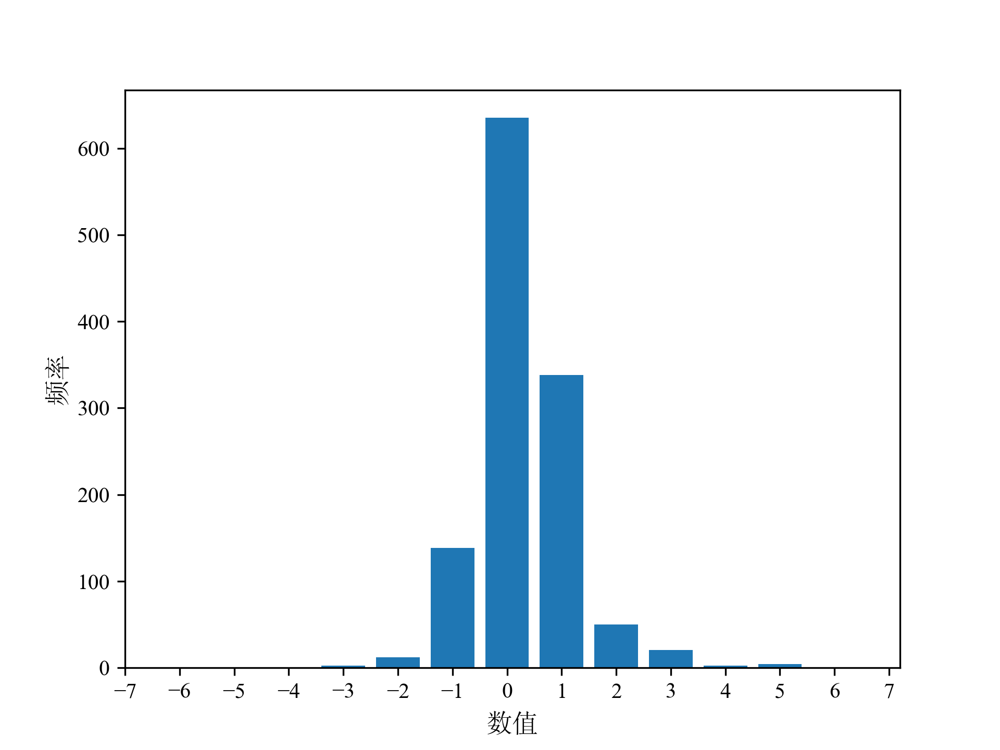

# myocardial contrast echocardiography systolic detection
This project is an implementation of an End-Systolic(ES) detection model based on deep learning techniques.  
Accurate identification of end-systolic frames is essential for the MCE myocaridal purfusion parameter calculation. Conventionally, cardiac cycle detection, rely on electrocardiography (ECG), but they encounter several challenges such as abnormal QRS morphology in ECG, errors in ECG electrode placement, and interference from patient movement. To overcome these issues, this project employs an image-based approach that leverages computer vision and deep learning techniques to detection ES frames 

# ground truth
If we define the end-systolic recognition problem as a classification problem, where frames in the MCE sequence are categorized into three classes: trivial frames, end-systolic frames , and end-diastolic frames , it can lead to imbalanced data. This is because in one cardiac cycle, there is only one frame for ES and ED, resulting in sparse labeling. Therefore, this study formulates the problem as a regression task.

we simulated left ventricular volume as the ground truth to detect ED and ES in cardiovascular magnetic resonance imaging. The left ventricular volume is estimated using a function that simulates a monotonically decreasing volume during the systolic phase and a monotonically increasing volume during the diastolic phase. the ground truth can be defined as follows:

$t_{ed}$ represents  the end-diastolic frame, where the value is defined as 1.2. $t_{es}$ denotes the end-systolic frame, and the value  defined as -0.2. $\tau$ is a constant set to 3.

# model
The MCE recognition model implemented in this project is based on a Seq2Seq (Sequence-to-Sequence) architecture, incorporating Convolutional Neural Networks (CNNs), Long Short-Term Memory (LSTM) networks, and attention mechanism. The model is specifically designed to accurately identify the end-systolic frames in myocardial contrast echocardiogram(MCE).

The CNN component(ResNet) of the model serves as the initial feature extractor, responsible for extracting relevant features from the input images. It consists of multiple convolutional layers followed by pooling and activation functions. The CNN encoder processes each frame independently, capturing spatial information and extracting image features.

The LSTM networks are then employed in both the encoder and decoder components. In the encoder, the LSTM network takes the encoded features from the CNN and processes them sequentially, capturing the temporal dependencies among the frames. This enables the encoder LSTM to encode the contextual information of the entire image sequence.

In the decoder, another LSTM network takes the encoded information from the encoder LSTM and generates a sequence of predictions, indicating the likelihood of each frame being an end-systolic frame. The decoder LSTM incorporates the temporal context from the encoder LSTM to refine the predictions and capture the sequential patterns specific to end-systolic frames.

To enhance the model's performance, an attention mechanism is incorporated. The attention mechanism allows the model to dynamically focus on the most relevant frames during the decoding process. By assigning higher weights to informative frames, the attention mechanism enables the model to effectively identify the key end-systolic frames in the MCE sequences.

# results
model gains 0.56±0.95 error in ES detection
prediciton results

ES error distribution

ES error distribution

compared with other models, seq2seq without attention and bi-LSTM.

